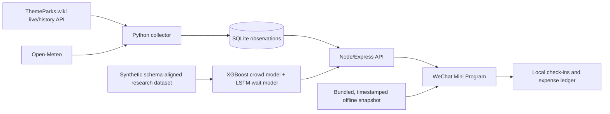

# Shanghai Disneyland Crowd Intelligence Mini Program

[中文说明](README.zh-CN.md) · [Architecture](docs/ARCHITECTURE.md) · [Data Card](docs/DATA_CARD.md) · [Model Card](docs/MODEL_CARD.md) · [Live Campaign](docs/LIVE_CAMPAIGN.md) · [Demo Script](docs/DEMO_SCRIPT.md)

An end-to-end portfolio prototype that combines a WeChat Mini Program, a live-data collector, an API service, and two forecasting pipelines to support Shanghai Disneyland visit planning and personal trip logging.

> **Portfolio status.** This is a personal engineering and ML prototype, not a continuously operated commercial service. The live collector can be deployed for a bounded observation campaign (for example, one month), while the repository remains fully reproducible in local/offline demo mode afterward.

> **Live experiment.** A bounded real-observation campaign is running from 2026-10-03 through 2026-11-02 on a small Alibaba Cloud instance in Hangzhou. The collector polls every five minutes and preserves each five-minute bucket rather than overwriting observations within the same hour. The read-only [health endpoint](http://47.99.129.17/health) and verification evidence are recorded in the [campaign record](docs/LIVE_CAMPAIGN.md).

> **Data honesty.** Current wait times and operating status come from real ThemeParks.wiki observations when the backend is online. Forecasts are model estimates. The checked-in training dataset is synthetic data aligned to the collector schema, so the reported metrics demonstrate pipeline correctness rather than real-world predictive validity. Every fallback or stale state is labeled in the UI.

## Why this project

Most crowd dashboards stop at a chart. This project explores the full product loop:

- collect and preserve verifiable five-minute observations;
- separate observed facts from model estimates;
- expose the data through a small API;
- translate forecasts into date rankings and time-slot routes;
- design a mobile experience that still behaves honestly offline;
- add personal visit logs, an attraction atlas, a map, and expense accounting.

The implementation contains roughly 9,000 lines across Python, Node.js, TypeScript/React, and SCSS.

## Product walkthrough

| Area | Purpose |
| --- | --- |
| **Today** | Live/stale-aware park status, attraction waits, weather, and source timestamp |
| **Forecast** | 30-day crowd and popular-ride wait estimates, ranked separately |
| **Check-in** | Visit calendar, attraction/show/character atlas, map, notes, and photos |
| **Route** | Time-slot advice and an ordered ride plan for a selected date |
| **My Park** | Ticket + in-park expense ledger and observed-data archive |

Screenshots and the short demo video will live in [`docs/assets`](docs/assets/README.md). The recommended recording flow is documented in [`docs/DEMO_SCRIPT.md`](docs/DEMO_SCRIPT.md).

## System architecture



See [`docs/ARCHITECTURE.md`](docs/ARCHITECTURE.md) for request flows, failure behavior, and design decisions.

## Data provenance and labels

| Artifact | Provenance | Role | Committed? |
| --- | --- | --- | --- |
| Attraction waits/status | ThemeParks.wiki live/history API | Observed current/history data | Only a small timestamped UI bundle |
| Weather | Open-Meteo | Observed/context feature | Only derived samples |
| Runtime SQLite database | Collector output | Local or deployed observation store | No |
| `data/raw/*.csv` | Synthetic, schema-aligned | ML pipeline demonstration | Yes |
| Forecasts/routes | XGBoost + LSTM when the API is connected; deterministic historical-profile fallback offline | Estimates, never presented as observations | Yes |
| Check-ins/ledger | User device storage | Personal product features | No |

The repository does **not** claim that synthetic training metrics generalize to real park operations. Read the full [`Data Card`](docs/DATA_CARD.md) and [`Model Card`](docs/MODEL_CARD.md).

## Models

Two targets are deliberately modeled separately:

1. **Daily crowd index — XGBoost regression** for ranking candidate visit dates.
2. **Hourly attraction wait — LSTM regression** for time-slot planning.

Evaluation on the current synthetic schema-aligned split:

| Model | MAE | RMSE |
| --- | ---: | ---: |
| Daily crowd index (XGBoost) | 4.30 | 5.31 |
| Hourly wait (LSTM) | 3.73 min | 4.64 min |

These numbers verify that the training/evaluation/export pipeline runs end to end; they are not production accuracy claims.

When the API or exported models are unavailable, the offline demo uses a deterministic historical-profile/heuristic fallback so every screen remains testable. The UI labels that state as an estimate; it is neither a live observation nor an ML accuracy result.

## Repository structure

```text
.
├── miniprogram/        # Taro + React WeChat Mini Program
├── server/             # Express API and managed collector process
├── ml_pipeline/        # Features, training, prediction, recommendation
├── data/               # Synthetic research dataset + exported outputs
├── models/artifacts/   # Small reproducible model artifacts and metrics
├── scripts/            # Snapshot export utilities
├── docs/               # Architecture, cards, deployment, demo, archive
├── deploy/alicloud/    # Reproducible Ubuntu/systemd/Nginx deployment
├── Dockerfile          # Optional bounded cloud deployment
├── docker-compose.yml
├── schema.sql
└── shanghai_disneyland_scraper.py
```

Generated dependencies, local databases, API keys, WeChat private config, and upload packages are intentionally excluded.

## Local setup

### 1. Python environment

```bash
python3 -m venv .venv
source .venv/bin/activate
pip install -r requirements.txt -r requirements-ml.txt
```

### 2. Start API + real collector

```bash
cd server
npm ci
npm start
```

By default the server performs one live refresh, backfills the anonymous history window when available, and then polls every 300 seconds. Optional environment variables:

```bash
THEMEPARKS_API_KEY=... HISTORY_BACKFILL_DAYS=30 COLLECT_INTERVAL_SEC=300 npm start
```

Never place the API key in the Mini Program or commit it to Git.

### 3. Build the Mini Program

```bash
cd miniprogram
npm ci
npm run build:weapp
```

Open `miniprogram/` in WeChat DevTools. The public repository uses `touristappid`; replace it with your own AppID for preview/upload.

For a deployed HTTPS API:

```bash
TARO_APP_API_BASE=https://your-api.example.com npm run build:weapp
```

The same HTTPS hostname must be configured as a WeChat `request` legal domain.

## Reproducible ML run

```bash
source .venv/bin/activate
python -m ml_pipeline.train
python -m ml_pipeline.predict
```

Before interpreting results, inspect `data/raw/dataset_manifest.txt`. Replacing the synthetic dataset with a sufficiently long, legally collected real dataset is the main research extension.

## Deployment strategy for a portfolio project

A one-month deployment is sufficient to demonstrate the complete lifecycle:

1. deploy the Docker service or native Ubuntu/systemd recipe with persistent storage;
2. collect and retain real observations in five-minute buckets;
3. monitor freshness and failure states;
4. record a 60–90 second phone demo;
5. export a provenance summary and archive the experiment;
6. stop the paid service while retaining local reproducibility.

See [`docs/DEPLOYMENT.md`](docs/DEPLOYMENT.md) and [`docs/ARCHIVE.md`](docs/ARCHIVE.md).

## Limitations and responsible use

- This project is not affiliated with, endorsed by, or operated by Disney.
- Live availability depends on third-party APIs and their terms, limits, and retention windows.
- Forecasts do not account for every closure, reservation rule, special event, or operational change.
- A low crowd prediction does not guarantee short waits for individual attractions.
- The current model evaluation uses synthetic schema-aligned data and requires real longitudinal validation.
- The application should not be presented as an official or safety-critical planning tool.

## What I would improve next

- collect a longer real, permission-compliant dataset;
- use rolling/time-based validation and confidence intervals;
- add data-drift and freshness monitoring;
- compare boosted trees with seasonal baselines before increasing model complexity;
- add automated API and interaction tests;
- run an accessibility and real-device usability study.

## Acknowledgements

- [ThemeParks.wiki](https://www.themeparks.wiki/) for attraction live/history APIs.
- [Open-Meteo](https://open-meteo.com/) for weather data.
- Taro, React, Express, XGBoost, and PyTorch open-source communities.
